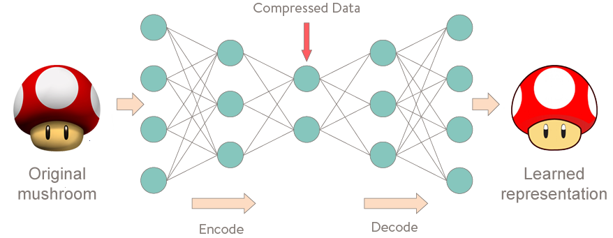
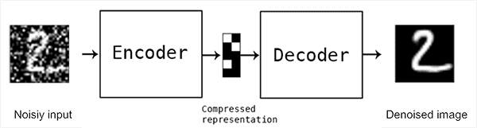
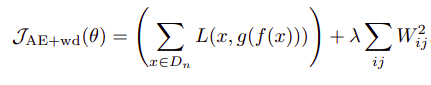
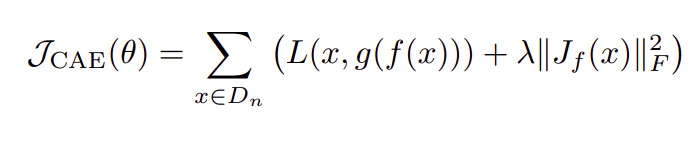
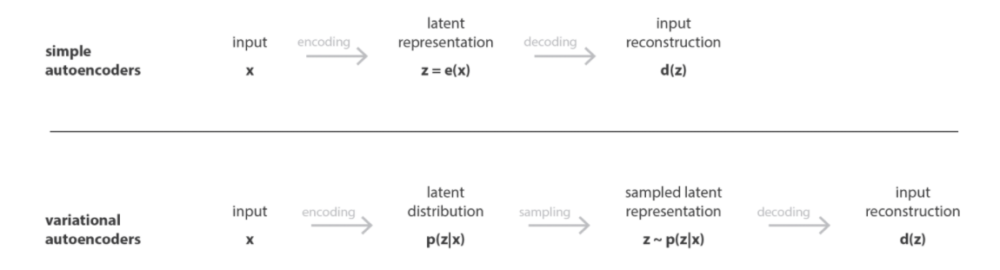

<!-- Referências:

https://icml.cc/2011/papers/455_icmlpaper.pdf

-->

# Autoencoders

**Vitor Lopes Maia Albuquerque <vlma@cin.ufpe.br>**

### Agenda:

1. O que é um autoencoder?
2. Importância dos autoencoders
3. Aplicações para o auto encoder (Exemplos)
4. Sugestão de aplicação ou uso
5. Agradecimentos e Conclusão

---

# 1) O que é um Autoencoder

<!-- Um autoencoder é uma rede neural que mapeia a entrada a própria entrada, por meio de uma representação intermediária,
sendo portanto um método de aprendizado não supervisionado. O interesse por trás dos autoencoders está na facilidade
do treinamento, e em usos criativos do bloco encoder e decoder, tal como das representações intermediárias. -->

- É um tipo de rede neural composta por blocos do tipo **decoder** e **encoder**
- O decoder e o encoder são treinados em conjunto para compor uma função identidade.
- Isso torna o treinamento fácil, visto que a entrada é seu próprio alvo
- A representação intermediária, ou latente, é um código para a entrada, e tende a ser representativo se o treino ocorreu apropriadamente

---

# 1) O que é um Autoencoder

---

# 1) Principais tipos de autoencoder

<!-- Existem várias classificações para os autoencoders, baseados por exemplo, se é composto por uma camada (autoencoder mais padrão) e
muitas camadas (autoencoder multicamada).
Além disso, podemos ter autoencoders convolucionais. Mais tarde mostrarei um exemplo.

Além disso, autoencoders que puramente aprender a função identidade as vezes são limitados, devido ao overfit necessário para se recuperar satisfatoriamente
cada exemplo do conjunto de treinamento. Então alguns autoencoders tem sua função de perda modificadas para se ter propriedades mais gerais dos dados de entrada, um uma propriedade de interesse.
 -->

## Autoencoder Denoising

<!--
Aplicação de ruído aos dados de entrada, para se aprender uma representação masi robusta
-->

---

## Autoencoder Esparso

<!--
Como exemplos desses autoencoders temos o Autoencoder esparso, que aplica penalização L1 na função de perda, criando uma representação mais esparsa.
https://www.deeplearningbook.com.br/capitulo-22-regularizacao-l1/
-->

---

## Contractive Autoencoders

<!--
Contractive autoencoders
Mais um autoencoder regularizado, mas com um termo de penalidade da função de perda sendo a Norma Matricial com p = 2
https://pt.wikipedia.org/wiki/Norma_matricial
-->

---

## Variational Autoencoder

---

# 2) Importância dos autoencoders

Aqui eu falo sobre a importância dos autoencoders, dando um enfoque nas aplicações que
o autoencoder tornou mais eficiente, ou possível. Além da importância dos autoencoders para
gerar feature maps para outros problemas.

---

# 3) Exemplos de autoencoders

Aqui eu falo sobre alguns exemplos de autoencoders
Uma lista de publicações pode ser encontrada [aqui](https://www.notion.so/2022-e80a8c4229034194af507b8f6d028d44?p=d8d8394e22cf4f209932e9379b4374ab)

1. Face swap (Autoencoders convolucionais)
2. IoT time series data recuperation
3. Graph representations

---

# 4) Sugestão de aplicação

Aqui eu faço uma sugestão de aplicação para o autoencoder

---

# 5) Agradecimentos e Conclusão

Falar sobre como deep learning tem sido importante, e bla bla bla
e como as aplicações são inúmeras,
e como é um privilégio estudar no CIn e ter a chance de conhecer de perto essa área da computação

---
